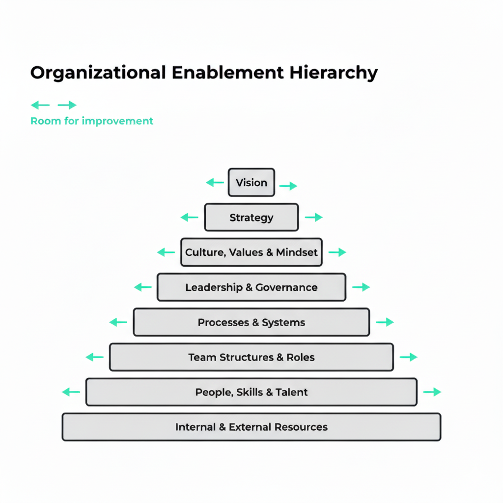

# Introduction
## Organizational Enablement Hierarchy

Every organization is built in layers.  
Some visible. Most invisible.  
All interdependent.

When those layers are aligned and strong, the organization thrives. When one weakens, everything above it wobbles.

We often focus on what’s visible — strategy, leadership, culture — the parts that make headlines and boardroom slides. But the real drivers of success lie beneath the surface: the foundations that *enable* everything else.

### The Core Premise

An organization’s effectiveness is determined not by the brilliance of its ideas, but by the **soundness of its structure**.  
Each layer of an organization supports and constrains the ones above it.  

If you try to improve a higher layer (like strategy or culture) without strengthening the layers below (like systems or team structure), your improvements will be short-lived or superficial.

This is the essence of the **Organizational Enablement Hierarchy** — a framework for understanding how organizations truly function, evolve, and succeed.

### The Eight Layers

From bottom to top, the hierarchy looks like this:

1. **Internal & External Resources** — The foundation of capacity: time, money, data, tools, partnerships.  
2. **People, Skills & Talent** — The human engine: competence, motivation, and potential.  
3. **Team Structures & Roles** — The architecture of collaboration: clarity, accountability, and flow.  
4. **Processes & Systems** — The rhythm of execution: routines, workflows, and tools that make quality repeatable.  
5. **Leadership & Governance** — The direction and discipline: how decisions are made and coherence maintained.  
6. **Culture, Values & Mindset** — The behavioral fabric: shared beliefs, norms, and the way people show up.  
7. **Strategy** — The alignment of effort: choosing what to pursue and what to ignore.  
8. **Vision** — The ultimate “why”: the meaning and aspiration that unite it all.

Each layer can only be improved to the extent that the one beneath it allows.  
You cannot fix strategy if leadership is weak. You cannot evolve culture if systems are chaotic. You cannot execute flawlessly if people lack clarity or skill.

### Why This Matters

Most organizational improvement efforts fail because they focus on symptoms, not structure.  
We see low morale and assume a culture problem — when it’s often a leadership or systems issue.  
We see slow execution and assume a strategy issue — when the real cause is weak team structure or unclear roles.

Understanding the **hierarchy of enablement** helps leaders diagnose accurately and intervene effectively. It turns random acts of improvement into *structured organizational development.*

### What You’ll Learn

This book is both a lens and a roadmap.  
You’ll learn how to:
- Diagnose the true root cause of dysfunction in your team or company.  
- Sequence change efforts for maximum leverage.  
- Align your organization from resources to vision.  
- Build enduring capability — layer by layer.

Each chapter explores one layer in depth: its purpose, common pitfalls, and actionable principles to strengthen it.

By the end, you’ll see your organization not as a collection of people and processes — but as a living, layered system that you can intentionally design, reinforce, and elevate.

Let’s begin at the foundation: **Internal & External Resources.**
